# hse_hw3_chromhmm

## Список анализируемых меток

**Клеточная линия:** A549

**Контроль:** ControlEtoh02AlnRep1 (ControlEtoh02AlnRep1.bam)

Гистоновая метка | Имя файла    | Оригинальный файл
:---------------:|:------------:|:-----------------:
H3k09me3         | H3k09me3.bam | wgEncodeBroadHistoneA549H2azDex100nmAlnRep1.bam
H3k04me2         | H3k04me2.bam | wgEncodeBroadHistoneA549H3k27acDex100nmAlnRep1.bam
H3k04me1         | H3k04me1.bam | wgEncodeBroadHistoneA549H3k27me3Dex100nmAlnRep1.bam
H2az             | H2az.bam     | wgEncodeBroadHistoneA549H3k36me3Dex100nmAlnRep1.bam
H3k04me3         | H3k04me3.bam | wgEncodeBroadHistoneA549H3k04me1Dex100nmAlnRep1.bam
H3k36me3         | H3k36me3.bam | wgEncodeBroadHistoneA549H3k04me2Dex100nmAlnRep1.bam
H3k27ac          | H3k27ac.bam  | wgEncodeBroadHistoneA549H3k04me3Dex100nmAlnRep1.bam
H3k09ac          | H3k09ac.bam  | wgEncodeBroadHistoneA549H3k79me2Dex100nmAlnRep1.bam
H3k27me3         | H3k27me3.bam | wgEncodeBroadHistoneA549H3k09acEtoh02AlnRep1.bam
H3k79me2         | H3k79me2.bam | wgEncodeBroadHistoneA549H3k09me3Etoh02AlnRep1.bam

**cellmarkfiletable.txt:**

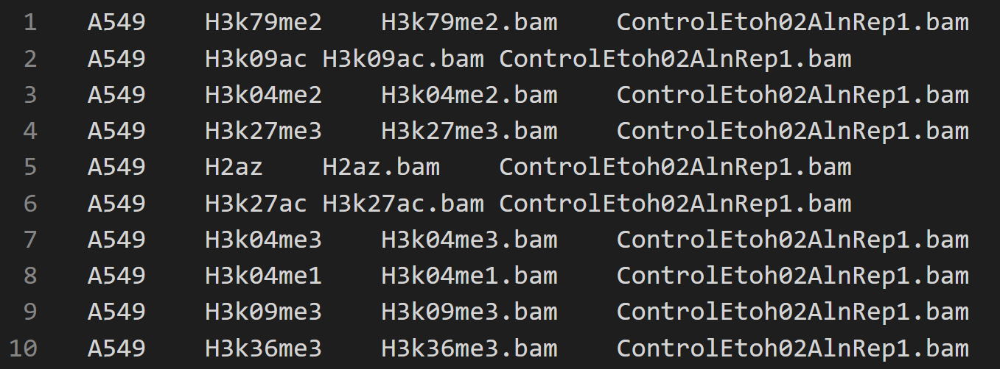

## Работа с ChromHMM

[Ссылка на Colab](https://colab.research.google.com/drive/1llVs1T7x1bb0oZD-fxRHMYG6F-CQfdNV?usp=sharing)

## Отчет ChromHMM

overlap                                             | emissions
:--------------------------------------------------:|:--------------------------------------:
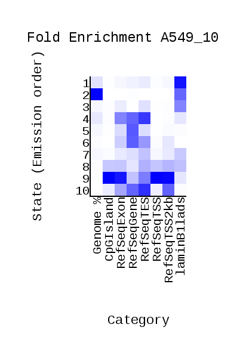               | 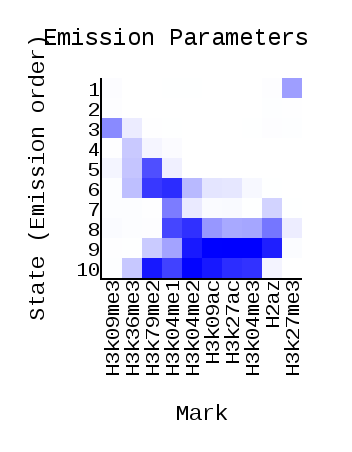

RefSeqTSS_neighborhood            | RefSeqTES_neighborhood            | transitions
:--------------------------------:|:---------------------------------:|:----------------------------------------:
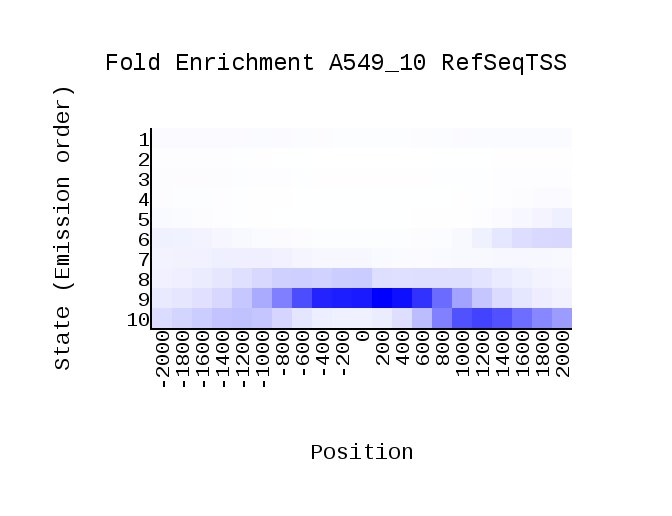 | 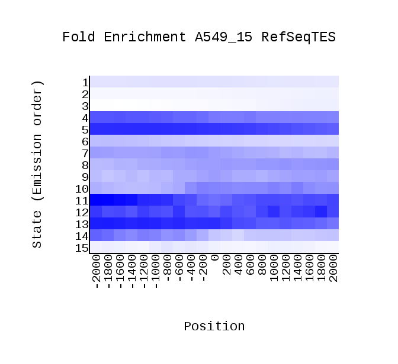 | 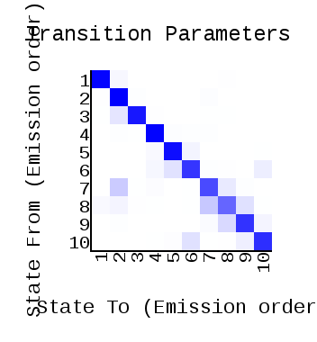

## UCSC GenomeBrowser

### Рассуждения и списки гистоновых модификаций, на которые состояния попадают чаще всего

<!-- 
1 -  https://via.placeholder.com/15/0000ff/000000?text=+
2 -  https://via.placeholder.com/15/009acb/000000?text=+
3 -  https://via.placeholder.com/15/34ff99/000000?text=+
4 -  https://via.placeholder.com/15/653399/000000?text=+
5 -  https://via.placeholder.com/15/659a34/000000?text=+
6 -  https://via.placeholder.com/15/006600/000000?text=+
7 -  https://via.placeholder.com/15/cb0034/000000?text=+
8 -  https://via.placeholder.com/15/cbcc65/000000?text=+
9 -  https://via.placeholder.com/15/ffff00/000000?text=+
10 - https://via.placeholder.com/15/cb9aff/000000?text=+ -->

Категория    | Состояние   | Название             | Описание                      | Отображение
:-----------:|:-----------:|:---------------------|:-----------------------------:|------------------------------------------:
CpGIsland    | 8, 9        | Промотор             | [CpGIsland](#CpGIsland)       |  
RefSeqExon   | 4, 9        | Промотор             | [RefSeqExon](#RefSeqExon)     |  
RefSeqGene   | 4, 5, 6, 10 | Транскрипц. участок  | [RefSeqGene](#RefSeqGene)     |    
RefSeqTES    | 4, 7, 8, 10 | Терминатор, Энхансер | [RefSeqTES](#RefSeqTES)       |    
RefSeqTSS    | 9           | Промотор, Энхансер   | [RefSeqTSS](#RefSeqTSS)       | 
RefSeqTSS2kb | 9, 8, 10    | Промотор, Энхансер   | [RefSeqTSS2kb](#RefSeqTSS2kb) |   
laminB1lands | 1, 2, 3     | Гетерохроматин       | [laminB1lands](#laminB1lands) |   

#### CpGIsland

Обычно располагаются в начале транскрибируемых генов, то есть возле промотора.

#### RefSeqExon

Экзон, обычно возле промотора.

#### RefSeqGene

Транскрипционный участок.

#### RefSeqTES

Терминатор. Но может быть и энхансером в силу соседства с сайтом транскрипции.

#### RefSeqTSS

Промотор. Но может быть и энхансером в силу соседства с сайтом транскрипции.

#### RefSeqTSS2kb

Промотор. Но может быть и энхансером в силу соседства с сайтом транскрипции.

#### laminB1lands

Неактивный участок (repressed). Гетерохроматин.

### Возможные названия

№ | Название                                        | Полное изображение
-:|:-----------------------------------------------:|:-----------------------------:
1 | Repressed                                       | 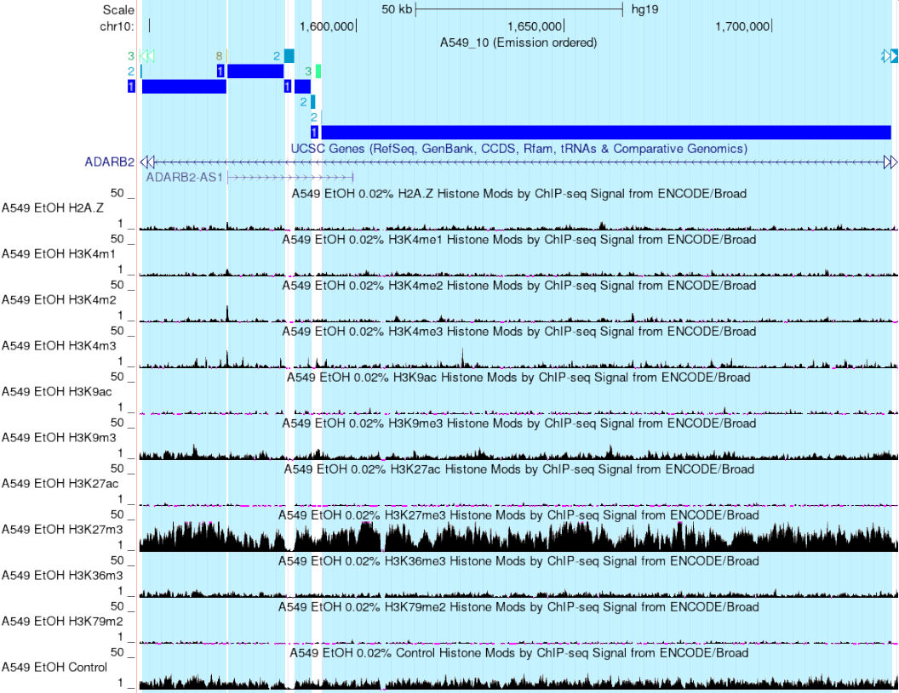
2 | Heterochromatin                                 | 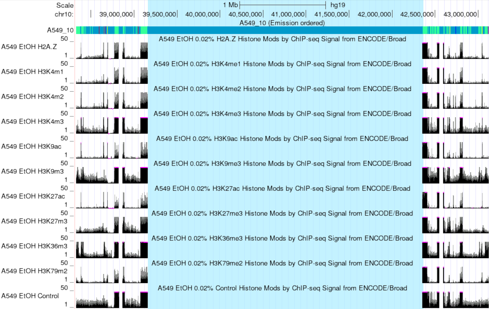
3 | Repressed                                       | 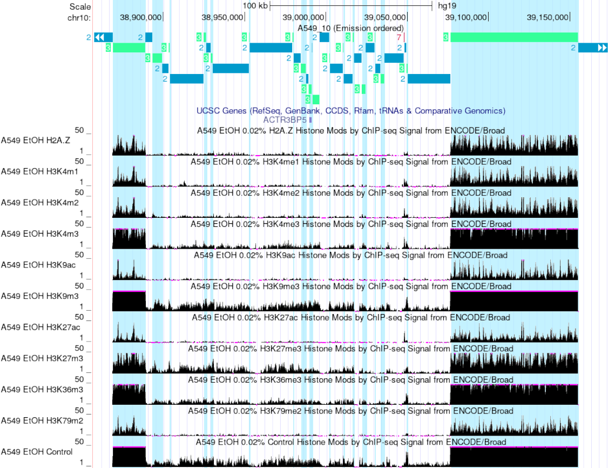
4 | Transcriptional /Enhancer /Promoter /Terminator | 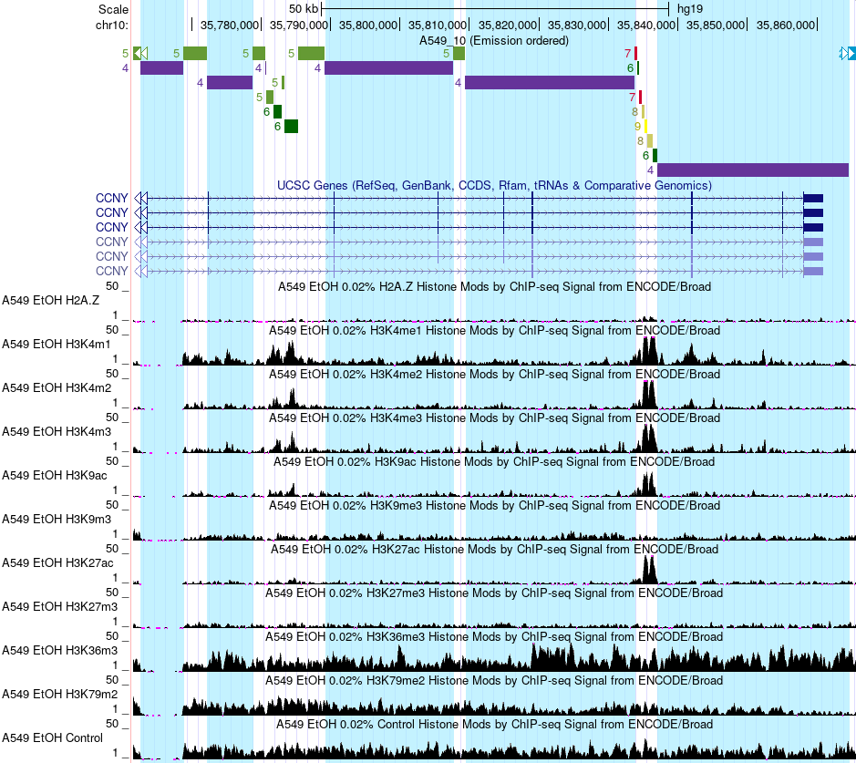
5 | Transcriptional                                 | 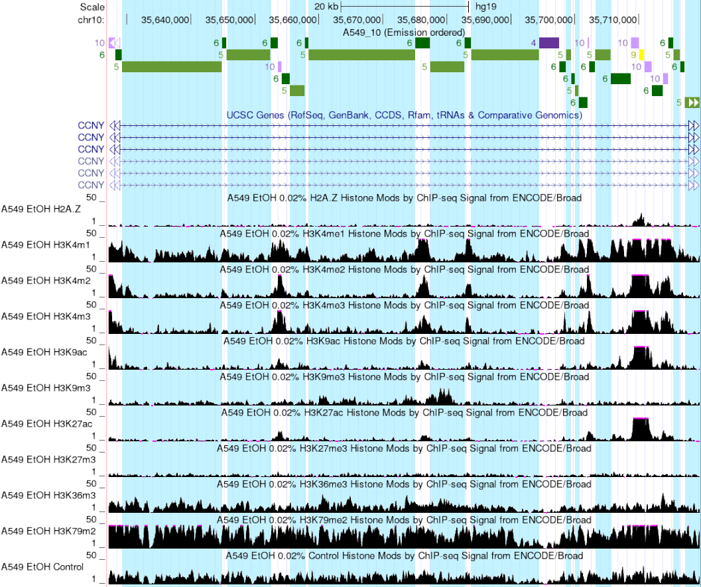
6 | Transcriptional /Enhancer                       | 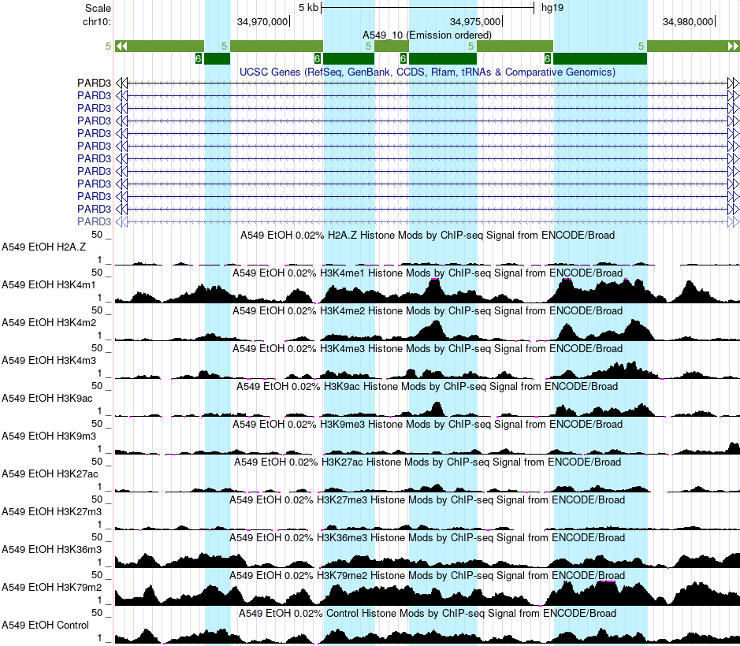
7 | Enhancer /Terminator                            | 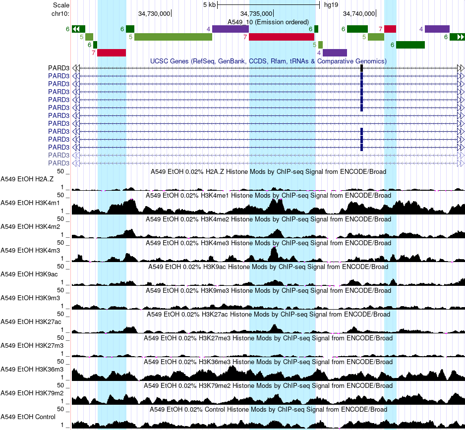
8 | Enhancer /Promoter /Terminator                  | 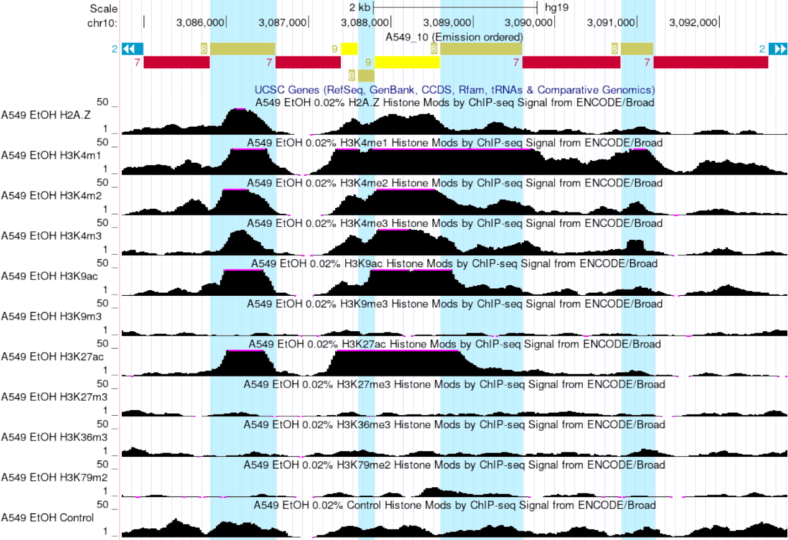
9 | Enhancer /Promoter /Transcriptional             | 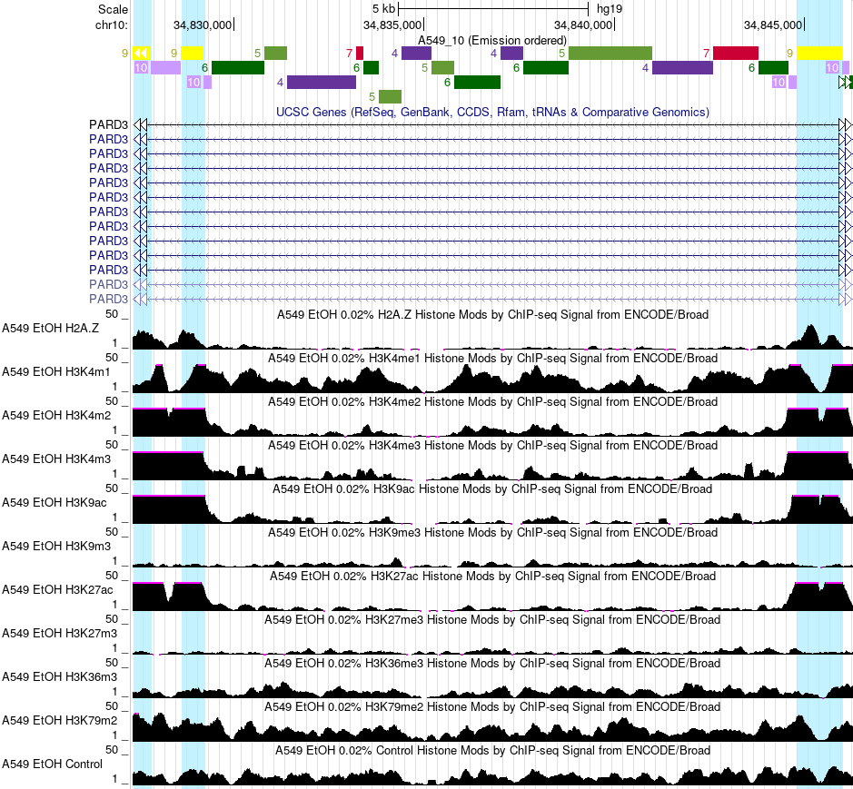
10| Enhancer /Promoter /Transcriptional /Terminator | 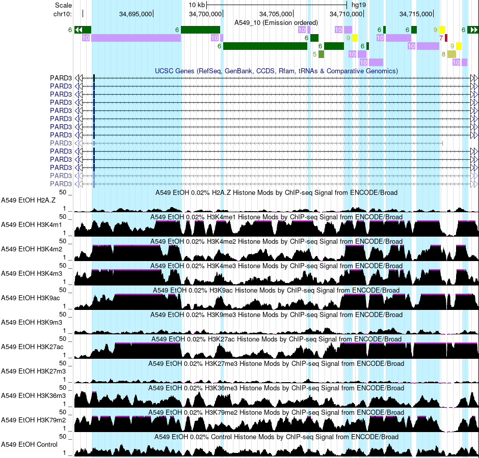

Будем руководствоваться приведенной [статьей](./2010%20Discovery%20and%20characterization%20of%20chromatin%20states%20for%20systematic%20annotation%20of%20the%20human%20genome.pdf), своими знаниями и этим слайдом с лекции: 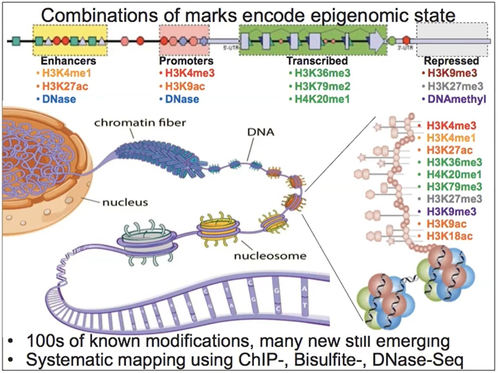

Проанализируем, с какими гистоновыми метками ассоциируются состояния и выберем наиболее характерные, примем за основные. Удалим те, которые не подтвердятся.

1. Ассоциируется с H3K27me3, в основном низкая активность.
    - Тут довольно просто рассудить по гистоновой метке и категории, это репрессированый участок.
2. Занимает большую часть всей разметки состояний, низкий сигнал.
    - Тут довольно просто рассудить по гистоновой метке и категории, это гетерохроматин.
3. Ассоциируется с H3K09me3, в основном низкая активность.
    - Тут тоже очевидно, это репрессированый участок.
4. Ассоциируется с H3K36me3. Показывает низкую активность, но попадает на ген (интрон + экзон).
    - Судя по категориям, это состояние может быть транскрипционным участком.
5. Ассоциируется с H3K79me2. Показывает низкую активность, но попадает на ген (интрон).
    - Категории подтверждают, что это транскрипционный участок.
6. Ассоциируется с H3K79me2, H3K04me1 => Transcriptional/Enhancer. Сильный сигнал, попадает на интрон => сделаем выбор в пользу энхансера.
7. Ассоциируется с H3K04me1, H2az. Сильный сигнал, попадает на интрон.
    - Похоже, это терминатор.
8. Ассоциируется с H3K04me1, H3K04me2, H2az. Не попадает на ген, сильный сигнал.
    - Так и не ясно, энхансер или промотор, в силу того, что 8 чаще попадает в категории относящиеся к промотору, примем его как название этого состояния.
9. Ассоциируется с H3K79me2, H3K09ac, H3K27ac, H3K04me3, H2az. Сильный синал, попадает на интрон гена.
    - Судя по категориям, это точно промотер.
10. Ассоциируется с H3K79me2, H3K04me2, H3K09ac, H3K27ac, H3K04me3, H3K04me1. Сильный синал, попадает на ген (интрон + экзон).
    - Из-за гистоновых меток, делаю выбор в пользу энхансера/промотора.

### Результат

№  | Название               | Полное изображение             | Комментарии/обоснование
:-:|:----------------------:|:------------------------------:|:---------------------------
1  | **Repressed**          |    | Ассоц. с H3K27me3
2  | **Heterochromatin**    |    |
3  | **Repressed**          |    | Ассоц. с H3K09me3
4  | **Transcriptional**    |    | Ассоц. с H3K36me3
5  | **Transcriptional**    |    | Ассоц. с H3K79me2
6  | **Enhancer**           |    | Ассоц. с H3K79me2, H3K04me1
7  | **Terminator**         |    | Ассоц. с H3K04me1, H2az
8  | **Promoter** /Enhancer |    | Ассоц. с H3K04me1, H3K04me2, H2az
9  | **Promoter**           |    | Ассоц. с H3K79me2, H3K09ac, H3K27ac, H3K04me3, H2az
10 | **Enhancer /Promoter** |  | Ассоц. с H3K79me2, H3K04me2, H3K09ac, H3K27ac, H3K04me3, H3K04me1

## Бонус

Полученный *[A549_10_dense.bed](results/A549_10_dense.bed)* был модифицирован вручную (Ctrl+F и "Заменить все") в *[A549_10_dense_upd.bed](./A549_10_dense_upd.bed)* с помощью добавления 10-ти состояний по примеру:

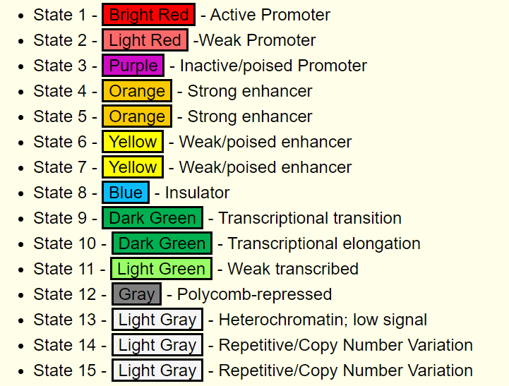

Состояния соотносились с их названиями по табличке с работой в **UCSC GenomeBrowser**.

Фрагмент полученного файла:

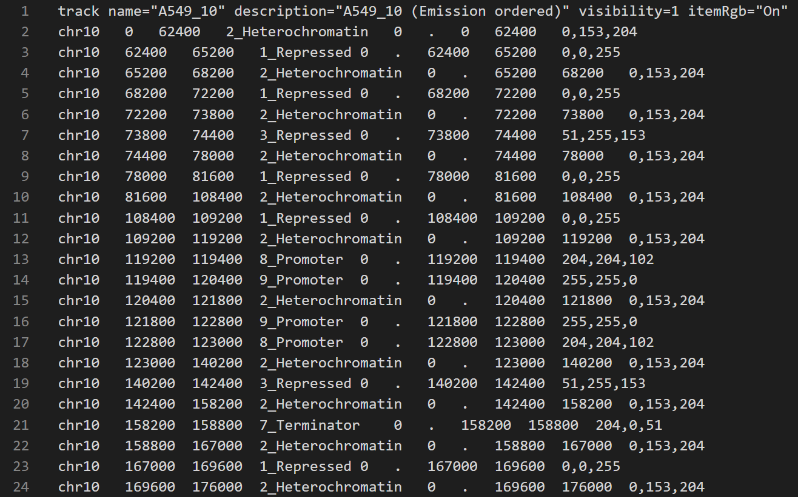

### Просмотр с выполненной разметкой

