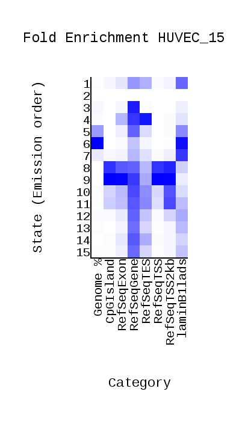
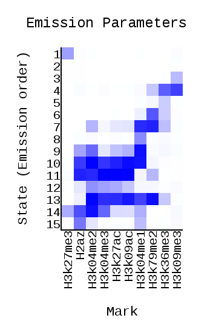
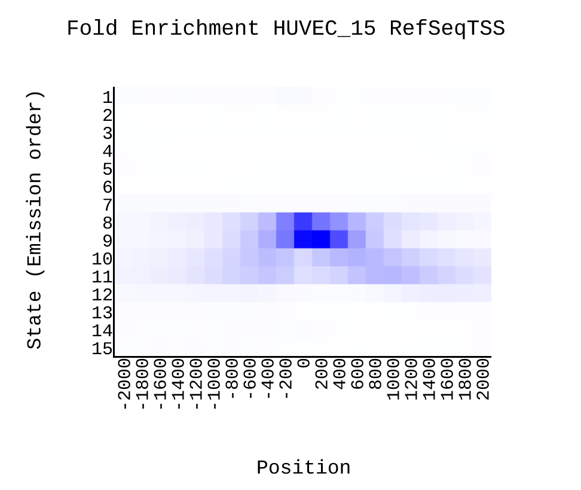
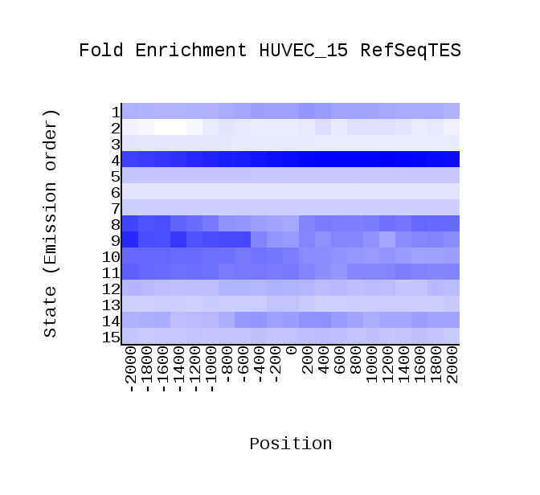
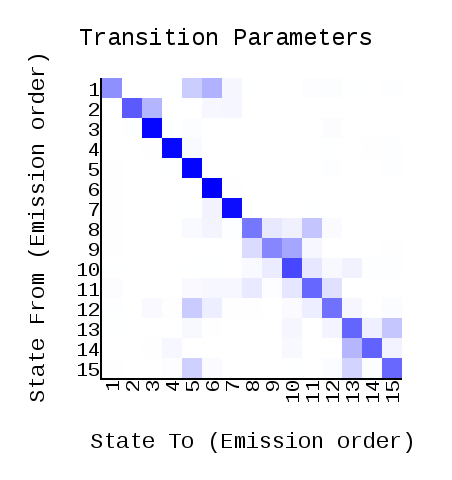
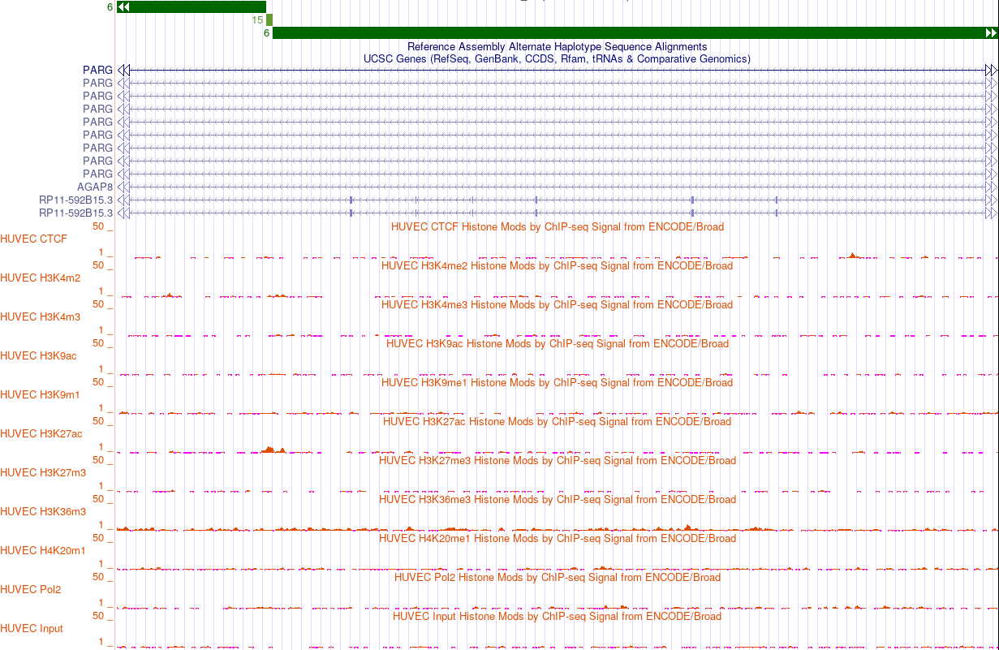
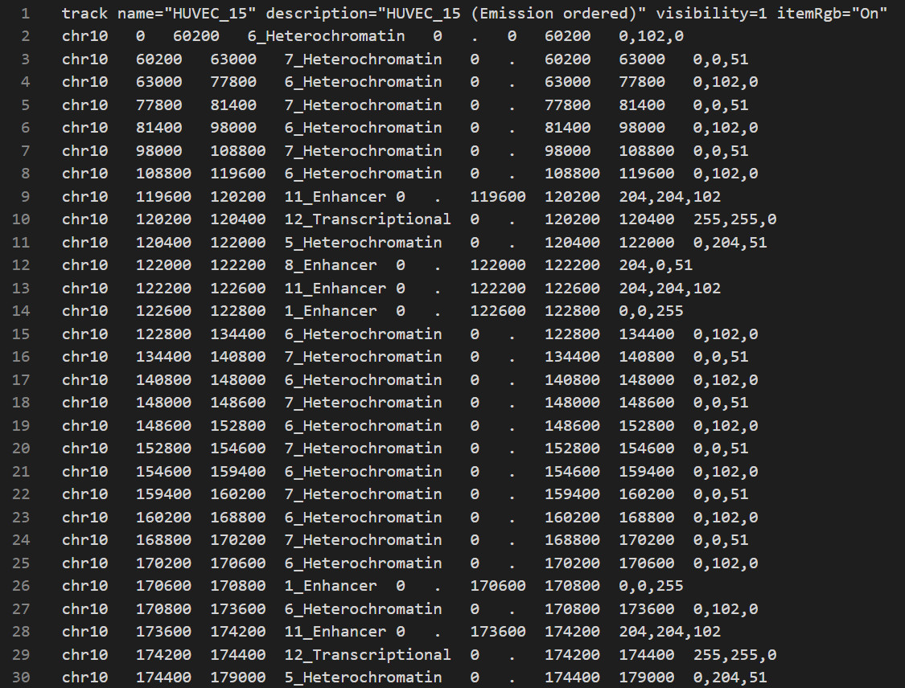

# hse_hw3_chromhmm

## Список анализируемых меток

**Клеточная линия:** HUVEC

**Контроль:** wgEncodeBroadHistoneHuvecControlStdAlnRep1.bam (Control.bam)

Гистоновая метка | Имя файла
:---------------:|:-----------:
H3k36me3         | H3k36me3.bam
H3k4me2          | H3k4me2.bam
H4k20me1         | H4k20me1.bam
Ctc              | Ctc.bam
H3k9me1          | H3k9me1.bam
Pol2b            | Pol2b.bam
H3k27ac          | H3k27ac.bam
H3k4me3          | H3k4me3.bam
H3k27me3         | H3k27me3.bam
H3k9ac           | H3k9ac.bam

**cellmarkfiletable.txt:**

## Работа с ChromHMM

[Ссылка на Colab](https://colab.research.google.com/drive/1Ki-ptRA6R1crE_Sd1NHeyil1JRGmtOry?usp=sharing)

## Отчет ChromHMM

overlap                                             | emissions
:--------------------------------------------------:|:--------------------------------:
                | 

RefSeqTSS_neighborhood                              | RefSeqTES_neighborhood                              | transitions
:--------------------------------------------------:|:---------------------------------------------------:|:----------:
 |  | 

## UCSC GenomeBrowser

Участки генома и соответствующие эпигенетические типы (и, желательно, профили эпигенетических меток).
 № | Название        | Полное изображение                        | Дополнительный фрагмент                   | Наблюдения
:-:|:---------------:|:-----------------------------------------:|:-----------------------------------------:|:---------:
1  | Enhancer        |    |                                           | Сильный сигнал и состояние попало на интрон.
2  | Repressed       |    |                                           | Не попадает на гены, сильный сигнал.
3  | Transcriptional |    |                                           | Ассоциируется с RefSeqGene. Попадает на интрон и показывает слабый сигнал.
4  | Repressed       |    |                                           | Ассоциируется с RefSeqTES, RefSeqGene, RefSeqExon
5  | Heterochromatin |    |                                           | Показывает слабый сигнал и попадает на участок репрессированного гетерохроматина и интроны генов.
6  | Heterochromatin |    |  | Самые частые и длинные отрезки помечены как 6-е состояние. Аналогично с 5-м состоянием : показывает слабый сигнал и попадает на участок репрессированного гетерохроматина и интроны генов.
7  | Heterochromatin |    |                                           | Показывает слабый сигнал и попадает на участок репрессированного гетерохроматина и интрон гена.
8  | Enhancer        |    |                                           | Частично попало на экзон, попадает на интрон. Сигнал не очень, но сильный. Ассоциируется с CpGIsland, RefSeqTSS, RefSeqTSS2kb
9  | Promoter        |    |                                           | Ассоциируется с CpGIslands, RefSeqExon, RefSeqTSS, RefSeqTSS2kb; попадает на экзон, сильный сигнал.
10 | Enhancer        |  |                                           | Сильный сигнал и состояние попало на интрон, также состояние ассоциируется с RefSeqGene.
11 | Enhancer        |  |                                           | Ассоциируется с RefSeqGene, попадает на интрон, слабый сигнал.
12 | Transcriptional |  |                                           | Ассоциируется с RefSeqGene, попадает на интрон, слабый сигнал (на H3K4m2 и H3K27ac видно, что становится сильнее, но там начинается 11-е состояние).
13 | Enhancer        |  |                                           | Ассоциируется с RefSeqGene, попадает на интрон, сильный сигнал.
14 | Enhancer        |  |                                           | Ассоциируется с RefSeqGene, попадает на интрон, сильный сигнал.
15 | Transcriptional |  |                                           | Ассоциируется с RefSeqGene, попадает на интрон, слабый сигнал.

## Бонус

Полученный *HUVEC_15_dense.bed* был модифицирован вручную и записан в *HUVEC_15_dense_upd.bed* с помощью добавления 15-ти состояний (соответствие номер-название установлено в табличке выше, при работе с *UCSC GenomeBrowser*):

Фрагмент полученного файла:

Просмотр с выполненной разметкой:

