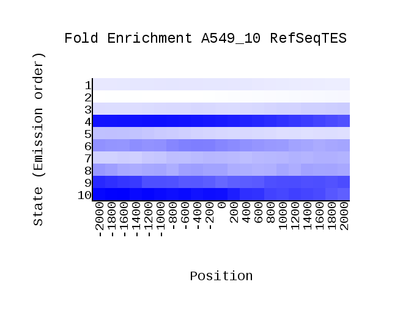

# hse_hw3_chromhmm

## Список анализируемых меток

**Клеточная линия:** A549

**Контроль:** ControlEtoh02AlnRep1 (ControlEtoh02AlnRep1.bam)

Гистоновая метка | Имя файла    | Оригинальный файл
:---------------:|:------------:|:-----------------:
H3k09me3         | H3k09me3.bam | wgEncodeBroadHistoneA549H2azDex100nmAlnRep1.bam
H3k04me2         | H3k04me2.bam | wgEncodeBroadHistoneA549H3k27acDex100nmAlnRep1.bam
H3k04me1         | H3k04me1.bam | wgEncodeBroadHistoneA549H3k27me3Dex100nmAlnRep1.bam
H2az             | H2az.bam     | wgEncodeBroadHistoneA549H3k36me3Dex100nmAlnRep1.bam
H3k04me3         | H3k04me3.bam | wgEncodeBroadHistoneA549H3k04me1Dex100nmAlnRep1.bam
H3k36me3         | H3k36me3.bam | wgEncodeBroadHistoneA549H3k04me2Dex100nmAlnRep1.bam
H3k27ac          | H3k27ac.bam  | wgEncodeBroadHistoneA549H3k04me3Dex100nmAlnRep1.bam
H3k09ac          | H3k09ac.bam  | wgEncodeBroadHistoneA549H3k79me2Dex100nmAlnRep1.bam
H3k27me3         | H3k27me3.bam | wgEncodeBroadHistoneA549H3k09acEtoh02AlnRep1.bam
H3k79me2         | H3k79me2.bam | wgEncodeBroadHistoneA549H3k09me3Etoh02AlnRep1.bam

**cellmarkfiletable.txt:**

## Работа с ChromHMM

[Ссылка на Colab](https://colab.research.google.com/drive/1llVs1T7x1bb0oZD-fxRHMYG6F-CQfdNV?usp=sharing)

## Отчет ChromHMM

overlap                                             | emissions
:--------------------------------------------------:|:--------------------------------------:
               | 

RefSeqTSS_neighborhood            | RefSeqTES_neighborhood            | transitions
:--------------------------------:|:---------------------------------:|:----------------------------------------:
 |  | 

## UCSC GenomeBrowser

Участки генома и соответствующие эпигенетические типы (и, желательно, профили эпигенетических меток).

 № | Название        | Полное изображение
:-:|:---------------:|:-----------------------------------------:
1  | Repressed       | 
2  | Heterochromatin | 
3  | Repressed       | 
4  | Repressed       | 
5  | Transcriptional | 
6  | Transcriptional | 
7  | Transcriptional | 
8  | Enhancer        | 
9  | Enhancer        | 
10 | Enhancer        | 
11 | Promoter        | 
12 | Promoter        | 
13 | Promoter        | 
14 | Promoter        | 
15 | Enhancer        | 

### Рассуждения и списки гистоновых модификаций, на которые состояния попадают чаще всего

1. **Repressed.**
   - Слабый сигнал, попадает на интрон.
   - Ассоциируется с laminB1lads.
   - Гистоновые модификации:
     - H3k27me3
2. **Heterochromatin.**
   - Наиболее распространенное состояние. Самые частые и длинные отрезки помечены как 2-е состояние.
   - Показывает слабый сигнал и попадает на участок репрессированного гетерохроматина и интроны генов.
   - Ассоциируется с laminB1lads.
3. **Repressed.**
    - Слабый сигнал (кроме H3k09me3), ассоциируется с ядерной ламиной, может не попадать на ген или попадать на интрон.
    - Ассоциируется с laminB1lads.
    - Гистоновые модификации:
      - H3k09me3
4. **Repressed.**
    - Попадает на интроны и экзоны генов.
    - Сильный сигнал.
    - Ассоциируется с: RefSeqGene, RefSeqTES.
    - Гистоновые модификации:
      - H3k36me3
      - H3k09me3
5. **Transcriptional.**
   - Ассоциируется с: RefSeqTES, RefSeqGene.
   - Попадает на интрон.
   - Сильный сигнал для H3k36me3, средний для H3k09me3, в остальном слабый.
   - Гистоновые модификации:
     - H3k36me3
6. **Transcriptional.**
    - Ассоциируется с: RefSeqGene.
    - Гистоновые модификации:
      - H3k79me2
7. **Transcriptional.**
    - Ассоциируется с: RefSeqGene.
    - Низкий сигнал.
    - Гистоновые модификации:
      - H3k79me2
      - H3k04me1
8. **Enhancer**
   - Ассоциируется с: RefSeqTES, RefSeqGene.
   - Сильный сигнал.
   - Гистоновые модификации:
     - H3k04me1
9. **Enhancer.**
    - Ассоциируется с: RefSeqTES, RefSeqGene.
    - Сильный сигнал.
    - Гистоновые модификации:
      - H3k04me1
      - H3k04me2
10. **Enhancer**
    - Ассоциируется с: RefSeqTES, RefSeqTSS2kb.
    - Сильный сигнал.
    - Гистоновые модификации:
      - H3k04me1
      - H3k04me2
      - H3k27ac
      - H3k09ac
11. **Promoter**
    - Ассоциируется с: CpGIsland, RefSeqExon, RefSeqTSS, RefSeqTSS2kb.
    - Попадает на экзон.
    - Сильный сигнал для H2az, H3k04me2, H3k04me3, H3k09ac. Средней силы сигнал для H3k27ac.
    - Гистоновые модификации:
      - H3k27ac
      - H3k09ac
      - H3k04me3
12. **Promoter.**
    - Ассоциируется с: RefSeqTSS.
    - Высокий сигнал для H3k04me2, H3k04me3, H3k27me3.
    - Гистоновые модификации:
      - H3k27ac
      - H3k04me2
      - H3k04me3
13. **Promoter.**
    - Ассоциируется с: RefSeqTES, RefSeqGene.
    - Сильный сигнал кроме H2az, H3k09me3, H3k27me3.
    - Гистоновые модификации:
      - H3k04me2
      - H3k79me2
      - H3k09ac
14. **Promoter.**
    - Ассоциируется с: CpGIsland, laminB1lads.
    - Сильный сигнал.
    - Гистоновые модификации:
      - H2az
      - H3k04me2
      - H3k04me3
15. **Enhancer.**
    - Ассоциируется с laminB1lads.
    - Попадает на интрон гена.
    - Сильный сигнал.
    - Гистоновые модификации:
      - H2az
      - H3k04me1

## Бонус

Полученный *A549_15_dense.bed* был модифицирован вручную (Ctrl+F и "Заменить все") в *A549_15_dense_upd.bed* с помощью добавления 15-ти состояний по примеру:

Состояния соотносились с их названиями по табличке с работой в **UCSC GenomeBrowser**.

Фрагмент полученного файла:

### Просмотр с выполненной разметкой

