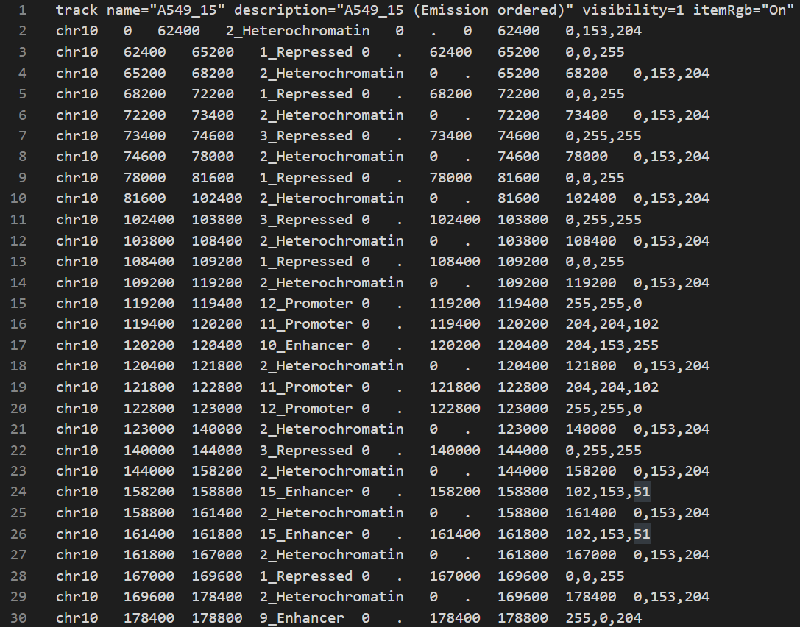

# hse_hw3_chromhmm

## Список анализируемых меток

**Клеточная линия:** A549

**Контроль:** ControlEtoh02AlnRep1 (ControlEtoh02AlnRep1.bam)

Гистоновая метка | Имя файла
:---------------:|:-----------:
H3k09me3         | H3k09me3.bam
H3k04me2         | H3k04me2.bam
H3k04me1         | H3k04me1.bam
H2az             | H2az.bam
H3k04me3         | H3k04me3.bam
H3k36me3         | H3k36me3.bam
H3k27ac          | H3k27ac.bam
H3k09ac          | H3k09ac.bam
H3k27me3         | H3k27me3.bam
H3k79me2         | H3k79me2.bam

## Работа с ChromHMM

[Ссылка на Colab](https://colab.research.google.com/drive/1llVs1T7x1bb0oZD-fxRHMYG6F-CQfdNV?usp=sharing)

## Отчет ChromHMM

overlap                                             | emissions
---------------------------------------------------:|:---------------------------------
                | 

RefSeqTSS_neighborhood                              | RefSeqTES_neighborhood                              | transitions
---------------------------------------------------:|:---------------------------------------------------:|:-------------------------
 |  | 

## UCSC GenomeBrowser

## Бонус

Полученный *A549_15_dense.bed* был модифицирован в *A549_15_dense_upd.bed* с помощью добавления 15-ти состояний:

Фрагмент полученного файла:

